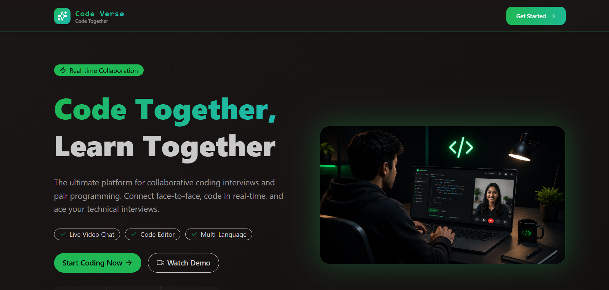
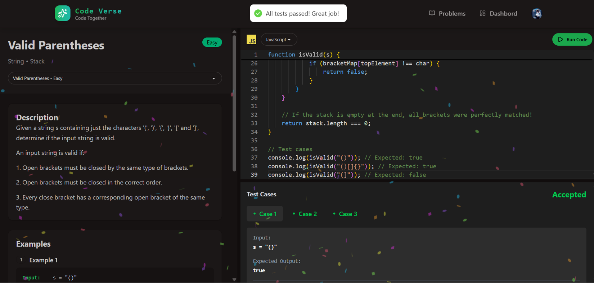
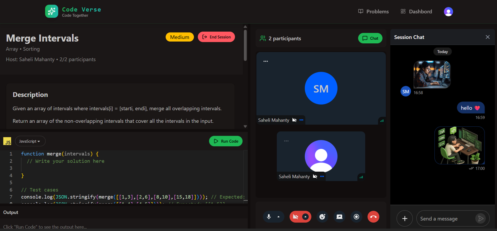

# 🚀 CodeVerse - CodeVerse – Real-Time Peer Coding Interview Platform!🚀


### 🌐 [Live Demo](https://codeverse-wkhy.onrender.com)


# Welcome to CodeVerse
It is a high-performance, real-time pair programming platform built to bridge the gap between developers, no matter where they are! Whether you're conducting a technical interview or building a project with a friend, CodeVerse makes collaboration seamless, fast, and fun.
# 🌐Features Demo



# 🌟 Why CodeVerse?
We believe coding together should be as fluid as coding alone. That’s why we’ve combined the power of VS Code’s editor engine with real-time video conferencing and a robust execution engine to create the perfect environment for pair programming!

# 🛠 The Power Under the Hood
## 🖥 Frontend Powerhouse
```
React 18 & Vite: Lightning-fast, responsive UI.

Monaco Editor: The exact same engine behind VS Code—get that professional syntax highlighting and intelligent autocompletion!

Tailwind & DaisyUI: Sleek, modern, and beautiful interface.
```
## ⚙️ Backend & Infrastructure
```
Node.js & Express: A scalable, high-performance API backbone.

MongoDB & Mongoose: Secure, reliable data persistence.

Clerk Authentication: Enterprise-grade security for your user sessions.

Stream Video SDK: Low-latency, high-quality video and audio for seamless communication.
```
# ⚡ Execution Engine
OneCompiler API Integration: Run your code instantly! Support for JavaScript, Python, and Java allows you to test algorithms and solve problems in real-time.

# 🏗 Project Architecture
CodeVerse is built as a clean Monorepo, separating concerns to ensure maximum scalability:

```
CodeVerse/
├── .github/                 # GitHub workflows (e.g., auto-deploy, cron tasks)
├── .vscode/                 # IDE configuration
├── backend/                 # Backend service (Node.js/Express)
│   ├── src/                 # Backend source code
│   │   ├── controllers/     # Logic for sessions and other API handlers
│   │   ├── lib/             # Utility and configuration files
│   │   ├── middleware/      # Authentication and security layers
│   │   ├── models/          # MongoDB data schemas
│   │   ├── routes/          # API route definitions
│   │   └── server.js        # Main server entry point
│   ├── package-lock.json    # Backend dependency lockfile
│   └── package.json         # Backend dependencies and scripts
├── frontend/                # Frontend application (React/Vite)
│   ├── public/              # Static assets
│   ├── src/                 # Frontend source code
│   │   ├── api/             # API service calls
│   │   ├── assets/          # Project images and assets
│   │   ├── components/      # Reusable UI components
│   │   ├── data/            # Static data/constants
│   │   ├── hooks/           # Custom React hooks
│   │   ├── lib/             # Client-side utility functions
│   │   ├── pages/           # Application views (Dashboard, Session, etc.)
│   │   ├── App.jsx          # Main application component
│   │   ├── index.css        # Global CSS styles
│   │   └── main.jsx         # React entry point
│   ├── .gitignore           # Frontend ignored files
│   ├── eslint.config.js     # ESLint configuration
│   ├── index.html           # Main HTML template
│   ├── package-lock.json    # Frontend dependency lockfile
│   ├── package.json         # Frontend dependencies and scripts
│   └── vite.config.js       # Vite build configuration
├── .gitignore               # Root-level ignored files
├── daily_ping.yml           # Cron schedule for deployment pinging
├── package-lock.json        # Root-level lockfile
└── package.json             # Root-level configuration
````
# 🚀 Get CodeVerse Running!

## 1. Backend Deployment (Render)
```
Root Directory: backend

Build Command: npm install

Start Command: node src/server.js

Key Environment Variables: MONGO_URI, CLERK_SECRET_KEY, STREAM_API_KEY, STREAM_API_SECRET, INNGEST_SIGNING_KEY
```

## 2. Frontend Deployment (Render)
Root Directory: frontend
```
Build Command: npm install && npm run build

Publish Directory: dist

Key Environment Variables: VITE_API_URL (your backend URL), VITE_CLERK_PUBLISHABLE_KEY
```
# 🚀 Ready to Code?
CodeVerse is more than just a project—it’s a collaborative ecosystem. We’ve turned complex deployment and real-time synchronization challenges into a smooth, professional tool!

# 👤 Author
Saheli Mahanty


## [Github](https://github.com/sahelidgp)

## [LinkedIn](https://www.linkedin.com/in/saheli-mahanty-a2216330b/)
